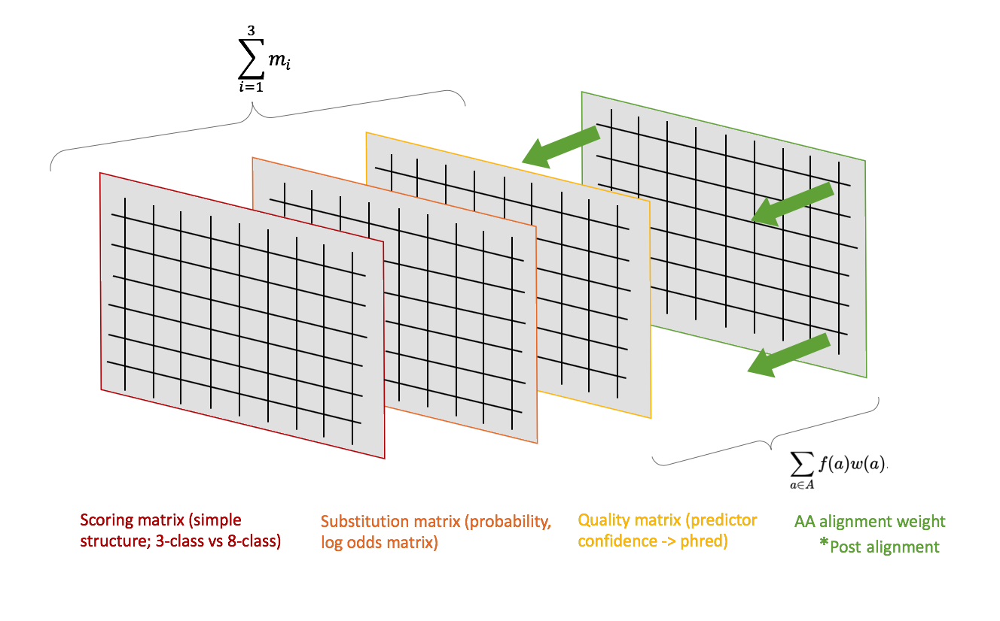
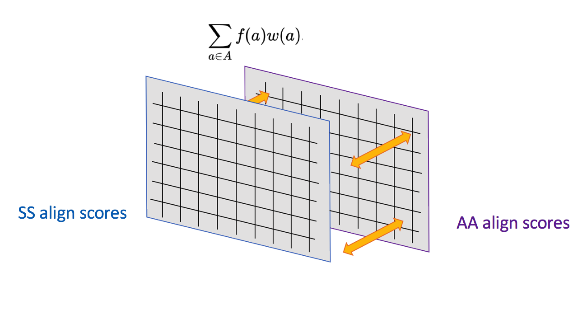

# DivProt   

Alignment programme for divergent proteins based on amino acid sequence and predicted structure, producing figures that map divergent proteins in proximal phylogenetic space.  

DivProt works by iteratively aligning sequences, storing the scores (bitscore, e-value, or alignment score for amino acids, and alignment score for secondary structure) in a matrix, and producing figures (heatmap, phylogenetic trees, and networks) to help visualise evolutionary relationships.

For the amino acid method, DivProt uses PSI-BLAST to pull conserved amino acid domains between the input sequences.
For secondary structure, DivProt utilizes Porter5 [https://github.com/mircare/Porter5] to predict structure (using either HHBLITS or both PSI-BLAST and HHBLITS) and custom aligns with a 3-tierd alignment strategy that utilises a scoring matrix based on structure grouping, a log-odd probability matrix, and predicted structure probabilty. Amino acid weighting from running your dataset through the PSI-BLAST method can influence your secondary structure scoring (or vise-versa) according to input specifications.



This is compiled to work on the NIH's Biowulf cluster, and will need adjusting to run locally. When running on biowulf, call an interactive session to avoid any jobs being killed if they take up too much memory + set up a custom environment to run python modules not automatically available (instruction on this are at the top of the pre_pre_proc file).

Anywhere below where you see .ssX, I am referring to the Porter5 output files .ss3 or .ss8. .ssX denotes that you should specify which one you are working with. 


#### Dependencies & modules
1. Python3
  - pandas
  - NumPy
  - Biopython
  - Biotite (if interested in 2D visualisation of structure)
  

2. Porter5
  - hhsuite
  - psiblast
  - uniprot (cp -r /fdb/hhsuite/uniprot20_2016_02 .)
  - uniref90
  
3. R
  - Packages: Biostrings, ggplot2, pheatmap, igraph, dplyr, tidyr,reshape, Matrix, Rtsne

4. clustalW


## For running on conserved amino acid domains:

Running the amino acid pipeline is extremely simple. Just upload your protein sequences and run the aligner script for PSIBLAST. Figures will be automatically generated and are stored in the "Rplots.pdf" file.

You just need to call the fasta file, and name the output directory you want your results to go into:
```
$ bash psi_matrix_aa.sh Koonin_81.fasta psi_aa_out
```

Note 1: You must activate an interactive session on Biowulf. R sessions ($module load R) are not allowed on the login node, and thus the Rscript will not run.

Note 2: the R script currently outs three matrices, the output of your iterative psi-blast alignments by e-value, percent identity, and bitscore. However, the figures produced by the script are fed only by the bitscore matrix, as we believe this one to be the most informative of the three psi-blast outputs. You can certainly change this though by going into the R script (R_script_aa.R) and replacing any instances of "bitscore_matrix" below line 70 with "evalue_matrix" or "pident_matrix". Figures will then be created with that data.

## For running on predicted secondary structure:


### Step 0.

[UPDATE: Porter5 is now Dockerized - instructions below will not be necessary, but may be faster. We will be testing]

You'll need to set up Porter5 with a single sequence before you can run all in your fasta file. Porter5 requests the paths to its dependencies. I do this by pulling the first sequence in my fasta file, creating a new .fa with that, and submitting that to Porter. This lets me input my paths and set everything up. You only need to do this once.

> Example of how I configure the paths (this will be almost the same for anyone else running on biowulf):

>uniref90 = /fdb/SIFT/uniref90.fa

>hhblits = hhblits [I call the hhsuite module with the job submission, or /usr/local/apps/hhsuite/3.0-beta.3/bin/hhblits without doing that should work too]

>uniprot = /data/belfordak/Buck_lab/Divergent_prots/DivProt/uniprot20_2016_02/uniprot20_2016_02 (cp -r uniprot20_2016_02 db to a dir you have permission to - giving the path to where it's hosted on biowulf will cause an error when you run Porter b/c you don't have permission to access the db in this location)

>psiblast = /usr/local/apps/ncbi-toolkit/21.0.0/bin/psiblast

(If found that your prediction works and you get your .ssX files, you're good to go. If you get an error message, it is likely due to your paths, even though there was probably no error called when you set them up. Also, just fyi, the error messages from Porter5 don't always obviously direct you to the problem (an error telling you a certain psi-blast related file could not be found doesn't necessarily mean there is anything wrong with your psi-blast directory/module/path, it could just as equally be your uniprot or uniref paths).
  
### Step 1. 
Run the pre_pre_processing script on your fasta input file. Both single and multiline fasta are fine.
HOWEVER, you cannot have any non-sequence characters in your file outside of the header. 

~ Note:  You can't have a * at the end of each protein sequence. This will cause Porter5 to fail
~ Note:  You can only have one .fasta file in the main DivProt dir, otherwise pre_pre_proc won't work. If you have multiple,     just place them in a sub dir and switch them out each new time you run pre_pre_proc

Ex.
```
$ bash pre_pre_processing.sh Adoma_polyoma_LTandVP1.fasta
```

### Step 2. 
Submit a swarm job like the prompt at the end of the pre_pre_processing.sh script says to do with the outfile. Do this from within the DivProt directory (no subdirectory), linking to the location of the file in ./split_out. 

Ex.
```
$ swarm -f split_out/porter5_submission.swarm -g 40 -t 8 --module hhsuite --time 12:00:00
```

### Step 3.
Run the pre_procesing.py script to take the Porter5 output and produce what I'm calling "fastqish" files.

They're basically fastq files:

>1. @Arowana_adomavirus_LT | 14901:17525 Reverse
>2. CCCHHHHHHHHHHHHHCCCCCCCCHHHHHHHHHHHHHHHHHCCCCCCCCCHHHHHHHHHHHHHHHHCCCC
>3. "+"
>4. !"#$%'(*++++*'%$"!!!!"##$&'+----,,+++*))&#!!!!!!!#'(+-..--+(%$##$$##"!

You want to run this script on all of the files in the directory (all individual sequences from your input, as Porter5 only takes one at a time)

So in the terminal, run:
```
$ for f in *.ssX; do python3 ../pre_processing.py $f ../original_fasta.fasta; done
```
Once this is done, you'll want to create one merged file of all the XX.ssX.fastqish files. This file contains the sequence name, secondary structure prediction, and phred score of each position structure.
Create the file with something like:
```
$ awk 1 *ssX.fastqish > whatever_file_name_you_want (e.x. original_fasta_name.ss3.fastqish)
```
~ Note: we *highly* recommend using the .ss8 files for the most sensitive alignments. Using .ss3 is certainly warranted though if you wish to decrease sensitivity to increase [simplistic] accuracy and prediction confidence. For more on this, see the technical manuscript. 

### Step 4
Run the aligner to produce a matrix of alignment scores of all your input structure sequences. 

Run aligner:
```
$ module load R
$ python3 Aligner_3_matrices.py split_out/your_fasta_name.ss3.fastqish
```

Alternatively, you can submit this as a batch job to free up your command line for the few hours the alignment will take. Here's an example of one of mine:

```
#!/bin/bash

source /data/belfordak/Buck_lab/conda/etc/profile.d/conda.sh 
conda activate base
conda activate all_libs  #remember I mentioned this above - it's a custom environment, mostly for pandas

module load clustalw
module load R

python3 Aligner_3_matrices.py split_out_fa_6/group_6.ss8.fastqish
```

ran with:
```
$ sbatch --time=16:00:00 --mem=4g --cpus-per-task=4 submit_group6_test.sh
```

### Step 4.5
Optional weighting



As the user, you have the option to weight your secondary structure alignment score matrix with an amino acid matrix (the reason we included the aa PSIBLAST methodology in this programme), or alternatively, weight your aa matrix with your ss matrix. What we mean by this is that weighting is not limited in any way. For example, you could weigh your new matrix at 80% secondary structure and 20% amino acid scoring, or 80% aa and 20% ss, depending on your question and what your data looks like. More details can be found in the Methods section of the paper.

How to run the weighting:

```
(sinteractive -> module load R) 
$ Rscript post_align_weight.R aa_align_bitscore_diag_normd_scaled.csv 0.25 ss_align_scores.csv 0.75
```

~Note: Order is important! Feed in the amino acid matrix first!

~Note: Be sure to run "aa_align_bitscore_diag_normd_scaled.csv" NOT "aa_align_bitscore_original.csv"!

~"aa_align_bitscore_diag_normd_scaled.csv" has been transformed (normalised to the self-score) and scaled for the purpose of weighting. "aa_align_bitscore_original.csv" is for you to view the original PSI-BLAST output values in a matrix, but will not be useful at all for weighting. 

The output file name is ""aa_ss_weighted_aligments.csv" we suggest renaming the file with information regarding how you weighted. Especially if you are running the script multiple times at different weights (the script will rewrite the file each time as the output will share the same name).

### Step 5
Run the R_figs_wrapper.py script to generate figures after loading an R module. You need to specify which of three figures you want after writing the file in the command line (examples below). Figures were separated out to accommodate users playing around with parameters without generating lots of unnecessary figures.

The three figures:
1. Heatmap
2. Phylogenetic tree(s) 
3. Networks

[TODO: figure here]

On mkaing trees: You have the optional variable parameter "-k" for cluster. If your input data is functionally divergent and does not contain a common ancestor (i.e. no relationship between them should reasonably be mapped, and they should not be connected on a tree) then you denote this with the k value when running the script. So denoting -k 3 would produce three phylogenetic trees. Default is 1. Clustering is done on k-means, following T-SNE reduction. The cluster plot is included in the  output file.

Here are examples of how to produce each figure from the wrapper script, note how they're all a little different, and like stated elsewhere in this README, order matters!:

```
#python3 run_figures.py alignmatrix.csv -heatmap
#python3 run_figures.py alignmatrix.csv -tsne_trees -k 2
#python3 run_figures.py alignmatrix.csv -network your_original_fasta.fa -tm 1.2 
```

On making networks: contains an optional variable parameter "-tm" for threshold modifier. The methodology to build the networks contains a cutoff value that reduces erroneous connection between nodes. Without this, given the sensitivity of DivProt, likely every protein you submitted would be connected. This cutoff value ..... (see methods section of paper).... . The default value is calculated based on the average length of your input sequence lengths. This value is printed to the terminal, so you can know at what value to start increasing or decreasing, if you wish to view your network with more or less stringency. We encourage the user to read the paper methods section before this, and consider biological meaningfulness when altering such a parameter.


#### On the structure:
> XX.ss3: helix (H), strand (E), and coil (C)

> XX.ss8: α-helix (H), π-helix (I), 3<sub>10</sub> helix (G), β-stand (E), β-bridge (B), H bonded turn (T), bend (S), and Coil and others (C)


####

~Note on run time:
As of July 2019, you can expect a job of ~100 sequences to take ~2 hours and a job of ~600 to take ~8 hrs. We're working on this (multithreading). Additionally, know that time is largely influenced by protein size. i.e. a dataset of sequences ~300 ssX sequence elements long will take ~3x the time of a dataset that contains the same number of sequences at ~100 length each.

Also note that the directory you run DivProt out of willl not really be available during a lot of this time (many temp files are created, and while they are deleted, when they're in there, they will hinder things you may try and do in that dir)

My TODO:
> 1. Add multithreading
> 2. Maybe make a python wrapper for matrix weighting script, since that's the only one left in R at the user level (pre-pre-proc is bash - this code may be unnecessary now with Porter updates, will just need to check speed comparison)
> 3. Add dynamic network edge cutoffs
> 4. Add sequence length warning and --help
> 5. Docker!
> 6. Have DivProt create a final html file with all figures, final matrix, stats, some representative sequenes? etc.

